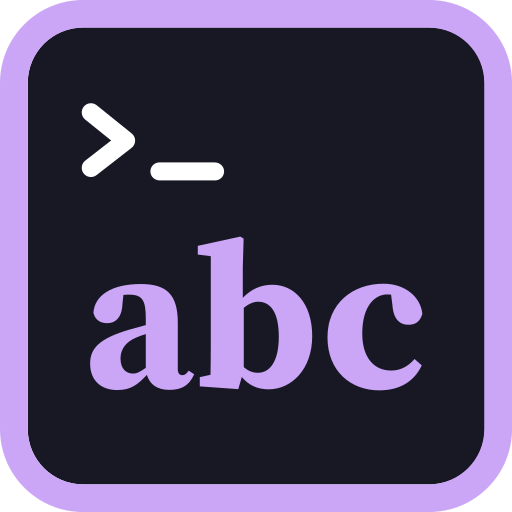

<div align="center">

  
  <br>
  <h1>FontGet - CLI Font Manager</h1>
  <p><strong></strong></p>

  [](https://github.com/Graphixa/FontGet/releases)
  [](LICENSE)
  [](go.mod)
  [](https://github.com/Graphixa/FontGet/actions)
  


<strong>
FontGet is a lightweight, cross-platform terminal font manager that can discover, install, and manage fonts across Windows, Mac OS & Linux.
<br>
<br>
</strong>
Fontget supports installing fonts from the following sources:

<ul style="list-style: none; padding-left: 0;">
  <li><a href="https://fonts.google.com/">- Google Fonts</a></li>
  <li><a href="https://www.nerdfonts.com/">- Nerd Fonts</a></li>
  <li><a href="https://www.fontsquirrel.com/">- Font Squirrel</a></li>

</ul>


</div>

## Installation

Install FontGet on your system using one of the commands below. FontGet is a single binary executable with no external dependencies. 

> Binaries are available for both `amd64` and `arm64` architectures.

#### Mac, Linux (Shell)

```sh
curl -fsSL https://raw.githubusercontent.com/Graphixa/FontGet/main/scripts/install.sh | sh
```

#### Windows (PowerShell)

```powershell
irm https://raw.githubusercontent.com/Graphixa/FontGet/main/scripts/install.ps1 | iex
```

More installation options can be found in the [Installation Guide](docs/installation.md).

## Installation via Package Manager 

### Windows

**[WinGet](https://winstall.app/)**
```
winget install --id "Graphixa.FontGet"
```

**[Chocolatey](https://chocolatey.org/)** (coming soon)

```powershell
choco install fontget
```

**[Scoop](https://scoop.sh/)**

```powershell
scoop bucket add fontget https://github.com/Graphixa/scoop-bucket
scoop install fontget
```

### macOS

**[Homebrew](https://formulae.brew.sh/)**

```sh
brew tap Graphixa/homebrew-tap
brew install fontget
```

### Linux

**[AUR (Arch User Repository)](https://aur.archlinux.org/packages/fontget)** (coming soon)

```bash
yay -S fontget
# or
paru -S fontget
```

### Build and Install from Source

Instructions for building FontGet from source can be found in the [Contributing guide](docs/contributing.md).

## Getting Started

FontGet makes it easy to search, install, and manage fonts from various sources. Here are some common commands to get you started:

### Search for Fonts to Install

```bash
fontget search "roboto"
```

### Install a Font

```bash
# Install a single font (using the font ID)
fontget add "google.roboto"

# Install multiple fonts at once
fontget add "google.roboto" "google.open-sans"
```

### Uninstall Font

```bash
# Remove an installed font
fontget remove "google.roboto"

# Remove multiple installed fonts
fontget remove "google.roboto" "google.open-sans"
```

### List Installed Fonts

```bash
# List all installed fonts
fontget list

# List all fonts matching "sans"
fontget list "sans" 
```

For a full list of commands refer to the [📖 Command Documentation](docs/usage.md) or by running `fontget help` in your terminal after installing.

## Additional resources

- **[⬇️ Installation Guide](docs/installation.md)**: Complete installation instructions for all platforms
- **[🛟 How to Use FontGet](docs/usage.md)**: Complete command reference and usage examples
- **[🤝 Contributing](docs/contributing.md)**: How to contribute to the project
- **[🔎 FontGet-Sources](https://github.com/Graphixa/FontGet-Sources)**: The font data repository that powers FontGet


## Commands

| Command | Purpose | Example |
|--------|--------------|---------|
| `help` | Show all fontget commands | `fontget help` |
| `search` | Search for fonts across sources | `fontget search "roboto"` |
| `add` | Install a font from available sources | `fontget add "google.roboto"` |
| `remove` | Uninstall fonts from the system | `fontget remove "google.roboto"` |
| `list` | List installed fonts on the system | `fontget list` |
| `info` | Show detailed info about a font | `fontget info "google.roboto"` |
| `sources` | Manage font sources | `fontget sources` |
| `config` | Manage configuration | `fontget config` |
| `export` | Export fonts to a manifest | `fontget export --output fonts.json` |
| `import` | Import fonts from a manifest | `fontget import fonts.json` |
| `backup` | Backup installed fonts files to a zip | `fontget backup --scope user` |
| `version` | Show version/build info | `fontget version` |
| `update` | Update FontGet | `fontget update` |
| `completion` | Generate shell completions | `fontget completion` |
---

> [!TIP]
> For more detailed info on FontGet usage, run `fontget --help` or check out the [Documentation](docs/usage.md).


## Credits

#### Design & UI 
- [Catppuccin](https://catppuccin.com/) (color palette)
- [Bubble Tea](https://github.com/charmbracelet/bubbletea) by [Charmbracelet](https://github.com/charmbracelet) (TUI framework)

#### Font sources
- [Google Fonts](https://fonts.google.com/)
- [Nerd Fonts](https://www.nerdfonts.com/) by [ryanoasis](https://github.com/ryanoasis/nerdfonts)
- [Font Squirrel](https://www.fontsquirrel.com/)

## Why did I make FontGet?

It started out as a way for me to re-install fonts everytime I reinstal my computer or get a new machine. As a graphic designer it's a pain to have to reload all my fonts and keep track of everything. with fontGet I can just run `fontget import`, or a custom script and have all my font's reloaded. I've recently been assisting with deploying machines at my workplace and we always fonts loaded onto the machines before they were deployed to new users and so I kind of made fontget to help solve this as well for deploying fonts to a heap of machines via scripting.

I've also been getting into ricing linux and windows systems which always require different fonts so I wanted something that was light weight, cross platform and based in the terminal to quickly download the font I need. What started as a concept powershell script, expanded into a fully fledged Go project to support not just Windows but also Mac OS and Linux. From there I just kinda fell in love with the project and added all the features that I (and maybe others) could want.

### Where does it go from here?

Honestly apart from some bug fixes and checking some things cross platform I don't think there are any features that I would want to add. There are a number of things that may not work 100% so I want to spend what spare time I have just improving the codebase and fixing up any little bugs that I've missed. Anyway this is my story. I hope you like it and please enjoy using FontGet!

## Other Items

- This tool is liceensed und ther [MIT License](LICENSE.md)
- To contribute, please read the [contributing instructions](docs/contributing.md).

## Support me

If FontGet has helped you or you'd like to support me or the project, consider a one-time donation:

 [](https://ko-fi.com/B0B51V2JIV)
